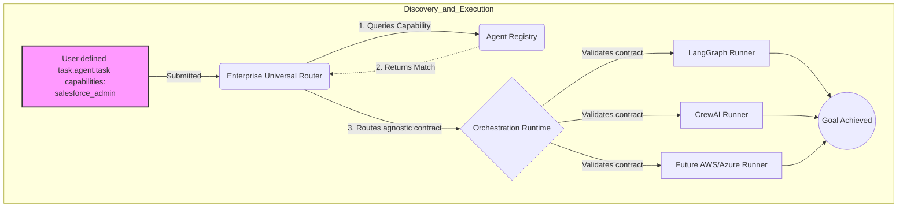

# ADR-0004: Agent Discovery and Universal Execution Vision

**Status:** Accepted  
**Date:** 2026-03-22  
**Authors:** Shail Shah  
**Deciders:** Shail Shah  
**Relates to:** ADR-0001, ADR-0002

---

## Context

As established in ADR-0001, the initial phase of `agent.task` focuses on Enterprise Readiness via an OSS plug. We are establishing a machine-readable, verifiable task contract with budget constraint enforcement that fits into existing orchestrators. 

However, looking ahead, the Agentic AI landscape will mature from **monolithic orchestrators** to **distributed agent networks**. In this future, users will not manually assign a task to a specific Python script; they will submit a task to a platform, which must dynamically discover the right agent and seamlessly execute the task regardless of the underlying hardware or framework.

We need to codify how `agent.task` serves as the foundational primitive for this future architecture without violating our rule against building a competing workflow runtime.

## Decision

We will design `agent.task` to explicitly support a **Universal Execution and Discovery Architecture**.

### 1. Standardization for Registering and Discovering Agents

We will utilize the `meta.capabilities_required` array (defined in ADR-0002) as the primary routing mechanism for future Agent Registries.

- **The Mechanic**: A central platform (internal enterprise router or public marketplace) reads the `.agent.task` file.
- **The Match**: The router compares the `capabilities_required` array against registered agents (e.g., matching `"servicenow_read_write"` to an IT support agent).
- **The Enablers**: We will strictly enforce schema validation on the `meta` key to ensure consistent routing behavior across all consuming platforms.

### 2. Universal Execution (Platform Agnosticism)

We commit to keeping the `.agent.task` specification **100% framework-agnostic**.

- **The Goal**: "Any platform can run the agent." A task written today should execute identically on AWS Bedrock Agents, LangGraph, AutoGen, or a proprietary enterprise system.
- **The Boundary**: `agent.task` defines the *contract* (goal, budget, accept, constraints). It explicitly **must never** define the *imperative execution graph* (e.g., node routing, state loops).
- **Execution Runners**: Frameworks will build "Universal Runners" (see `examples/poc_runner.py`) that ingest the `agent.task`, translate the constraints into their engine's native guardrails, inject the `goal` into the prompt, and execute.

## Practical Implementation of the 3-Phase Vision

To understand how this architecture fundamentally changes the agentic AI landscape, consider the following real-world lifecycle of `agent.task`:

### Phase 1: Enterprise Readiness (OSS Plug)
**The Reality Today:** Enterprises want to adopt agentic AI, but InfoSec teams block deployment because Python scripts running LangGraph or CrewAI can infinitely loop, burn excessive API costs, or make destructive state changes without verifiable boundaries.
**The Fix:** The enterprise developers write an `agent.task` file. When the task triggers, the CI/CD pipeline uses `cli-ts` or `cli-py` to strictly validate the schema. During execution, the orchestrator reads the `budget: { cost_usd: 5.00 }` from the `.agent.task` file and implements a hard kill-switch. If the agent fails, the orchestrator triggers the steps defined in the `rollback` array. Risk is explicitly bounded by a verifiable contract.

### Phase 2: Standardization for Discovery
**The Reality in 2027:** Companies will maintain hundreds of specialized agents ("HR Policy Agent", "Stripe Refunds Agent"). An employee won't know *which* Python script or agent to invoke for a specific task.
**The Fix:** Users submit generic `agent.task` files to an internal "Agent Router". The file contains `"meta": { "capabilities_required": ["salesforce_read"] }`. The Router queries the Agent Registry, discovers the exact agent possessing those capabilities, and automatically routes the `.agent.task` envelope to it.

### Phase 3: Universal Execution (Platform Agnosticism)
**The Reality in 2028:** Enterprises currently spend months writing hundreds of agents in CrewAI, creating massive vendor lock-in. 
**The Fix:** Because the business logic (goal, limits, accept criteria) is stored purely in `.agent.task` arrays rather than Python code, it is 100% interoperable. If a superior orchestration engine is released, the enterprise simply points the new runtime at their GitHub folder of `.agent.task` files. The new platform parses the goals natively and executes identically, destroying vendor lock-in.

### Architecture Diagram

## Consequences

### Positive

- **No Vendor Lock-in**: Enterprise users can define thousands of tasks in `.agent.task` format. If they migrate from CrewAI to LangGraph in 2027, their task library remains exactly the same.
- **Marketplace Enablement**: Standardized capability requirements open the door for a robust third-party ecosystem where agents compete to fulfill tasks.
- **Clear Separation of Concerns**: Forces orchestration logic (how to do it) out of the definition (what to achieve).

### Negative / Risks

- **Fragmentation**: Evaluator logic (e.g., how the `rubric` acceptance criteria is evaluated by an LLM-as-judge) might vary slightly between executing platforms, causing a task to pass on one platform but fail on another.
- **Complexity**: Requiring platforms to build `agent.task` adapters puts the integration burden on the OSS community.

## Alternatives Considered

### Alternative 1: Build execution logic directly into `agent.task`

**Rejected**. If `agent.task` dictated state machines or node traversal, it would become a new competing runtime framework. This violates ADR-0001 and destroys our ability to integrate openly across the ecosystem.

### Alternative 2: Defer discovery to a separate file (e.g., `routing.json`)

**Rejected**. The required capabilities are inextricably linked to the task itself. Separating them creates synchronization issues and adds unnecessary bloat. `meta.capabilities_required` natively handles this within the single-file contract.
